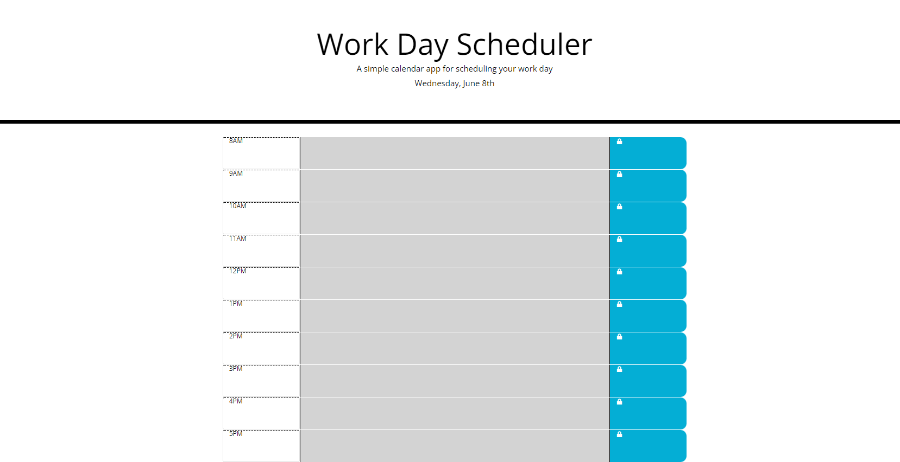

# Work Day Scheduler Starter Code

Deployed Application URL: https://hephaestus01.github.io/cbc-m5_challenge/
Github Repository: https://github.com/Hephaestus01/cbc-m5_challenge

This application is intended to help a user keep track of their tasks, on any given day. When the page loads, the current date will be displayed, along with a series of timeblocks, each represent a different hour of the work day, between 8AM and 5PM. The user can input their task items into the timeblock's text area, and then save their task by clicking the corresponding save button. This input data will be locally stored in the browser's memory, and called back whenever the page is loaded, so that the user can maintain their task items between sessions.

